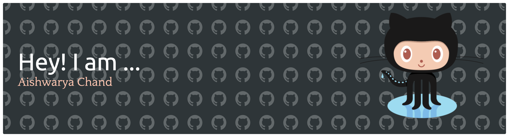

# Hi there 👋 I'm Aishwarya Chand  

🤖 **AI Engineer / Researcher** @ Human Behavior Modeling Lab — working on **Multimodal AI & LLM Systems**  
💻 Exploring **Software Engineering, Machine Learning, and AI Research** opportunities  
🎓 Graduated with a **Master’s in Computer Science (AI specialization)** from University at Buffalo (SUNY)  

---

## 🚀 About Me  

- 🔬 Currently building **deep learning pipelines** combining **vision, language, and behavior modeling**  
- 💡 Experience as **AI Software Engineer (TCS – Citrix)** — developed ML-driven solutions & optimized enterprise APIs  
- 🧩 Skilled in **LLM-powered applications**, **REST APIs**, and **MLOps deployment** . 
- 🎤 Delivered **workshops on Generative AI** for 200+ learners  
- 📊 Passionate about applying AI to **healthcare, accessibility, and financial analytics**  

---

## 📌 Skills  

- **Languages:** Python, SQL, C++, Java  
- **ML/DL:** PyTorch, TensorFlow, Transformers, XGBoost, SHAP  
- **LLMs/NLP:** Hugging Face, RAG, LangChain, Prompt Engineering, Fine-tuning  
- **Data & Cloud:** Spark, BigQuery, AWS (SageMaker, Redshift, Lambda), Azure, Snowflake, Tableau  
- **MLOps/Dev:** FastAPI, Docker, MLflow, Git, Streamlit, CI/CD  

---

## ✍️ Blogs  

  
  
  

  

---

## 📫 Connect with Me  

- 🔗 [LinkedIn](https://linkedin.com/in/aishwaryachand)  
- 🌐 [Portfolio](https://aishwaryachand.io)  
- 💻 [GitHub](https://github.com/aishwaryachand)  
- 📬 Email: **aishwarya7811@gmail.com**  

---

## ⚡ Fun Fact  

I love **teaching AI concepts** as much as building them — from mentoring 200+ students as a TA to running AI workshops, I enjoy breaking down cutting-edge tech into simple, practical insights.  

---

